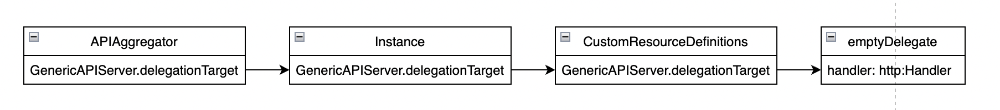

# API Server 启动流程

整个流程分以下 3 大步骤：
* 生成配置
* 生成 Server
* 启动 Server

## 生成配置

### 通用配置
通过 [buildGenericConfig](./server.go) 函数生成通用配置：

```go
func buildGenericConfig(...) (...) {
	/////////////////////////// 
	// 1. 初始化通用配置结构体 
	genericConfig = genericapiserver.NewConfig(legacyscheme.Codecs)
	
	...
	
	/////////////////////////// 
	// 2. 生成 Etcd 相关配置
	// 在 ApplyWithStorageFactoryTo 函数中，将配置保存到 genericConfig.RESTOptionsGetter
	storageFactoryConfig := kubeapiserver.NewStorageFactoryConfig()
	completedStorageFactoryConfig, err := storageFactoryConfig.Complete(s.Etcd)
	...
	storageFactory, lastErr = completedStorageFactoryConfig.New()
	...
	s.Etcd.ApplyWithStorageFactoryTo(storageFactory, genericConfig)
	...
	///////////////////////////
	// 3. 认证器相关
	// 认证器相关内容保存在 genericConfig.Authentication.Authenticator 中 
	s.Authentication.ApplyTo(&genericConfig.Authentication, genericConfig.SecureServing, genericConfig.EgressSelector, genericConfig.OpenAPIConfig, genericConfig.OpenAPIV3Config, clientgoExternalClient, versionedInformers)
	
	//////////////////////////
	// 4. 授权器相关
	// 很显然，授权器相关内容保存在 genericConfig.Authorization.Authorizer 中
	genericConfig.Authorization.Authorizer, genericConfig.RuleResolver, err = BuildAuthorizer(s, genericConfig.EgressSelector, versionedInformers)
	
	...
	//////////////////////////////////
	// 5. 准入控制器相关 
	// 授权器相关内容保存在 genericConfig.AdmissionControl 中
	admissionConfig := &kubeapiserveradmission.Config{
		ExternalInformers:    versionedInformers,
		LoopbackClientConfig: genericConfig.LoopbackClientConfig,
		CloudConfigFile:      s.CloudProvider.CloudConfigFile,
	}
	...
	s.Admission.ApplyTo(genericConfig, versionedInformers, kubeClientConfig, utilfeature.DefaultFeatureGate, pluginInitializers...)

	return
}
```

ps：准入控制器插件在 [RegisterAllAdmissionPlugins](../../../pkg/kubeapiserver/options/plugins.go) 中注册。
ps：在 `c.Admission.ApplyTo()` 中将注册的各个插件变换抽象成接口 [Interface](../../../staging/src/k8s.io/apiserver/pkg/admission/interfaces.go)

### 最终配置

生成通用配置后，将通用配置放入最终配置 [Config](../../../pkg/controlplane/instance.go) 结构体中。

```go
func CreateServerChain(completedOptions completedServerRunOptions, stopCh <-chan struct{}) (*aggregatorapiserver.APIAggregator, error) {
	// kubeAPIServerConfig 为最终配置
	kubeAPIServerConfig, serviceResolver, pluginInitializer, err := CreateKubeAPIServerConfig(completedOptions)
	...
	apiExtensionsServer, err := createAPIExtensionsServer(apiExtensionsConfig, genericapiserver.NewEmptyDelegateWithCustomHandler(notFoundHandler))
	...
	kubeAPIServer, err := CreateKubeAPIServer(kubeAPIServerConfig, apiExtensionsServer.GenericAPIServer)
	...
	aggregatorServer, err := createAggregatorServer(aggregatorConfig, kubeAPIServer.GenericAPIServer, apiExtensionsServer.Informers)
	...
	return aggregatorServer, nil
}
```


## 生成 Server

生成配置后，接着就利用配置生成 Server。kube-apiserver 组件中有 3 中 Server，它们的定义分别是

### extension server

```go
type CustomResourceDefinitions struct {
	GenericAPIServer *genericapiserver.GenericAPIServer
	Informers externalinformers.SharedInformerFactory
}
```

CustomResourceDefinitions.GenericAPIServer 通过 `c.GenericConfig.New("apiextensions-apiserver", delegationTarget)` 生成。此时的 delegationTarget 为空（实际上由 `NewEmptyDelegateWithCustomHandler()` 生成）。

### api server

```go
type Instance struct {
	GenericAPIServer *genericapiserver.GenericAPIServer
	ClusterAuthenticationInfo clusterauthenticationtrust.ClusterAuthenticationInfo
}
```

Instance.GenericAPIServer 通过 `c.GenericConfig.New("kube-apiserver", delegationTarget)` 生成。此时的 delegationTarget 则是上面的 CustomResourceDefinitions.GenericAPIServer。

### aggregate server

```go
type APIAggregator struct {
	GenericAPIServer *genericapiserver.GenericAPIServer
	...
}
```

APIAggregator.GenericAPIServer 通过 `c.GenericConfig.New("kube-aggregator", delegationTarget)` 生成。此时的 delegationTarget 则是上面的 Instance.GenericAPIServer。

### 小结

这 3 类 Server 通过 `GenericAPIServer.delegationTarget` 字段连接起来，组成一个 server chain：



## 启动 Server

APIAggregator.Run() ->  preparedGenericAPIServer.Run() -> preparedGenericAPIServer.NonBlockingRun() -> SecureServingInfo.Serve() -> RunServer()