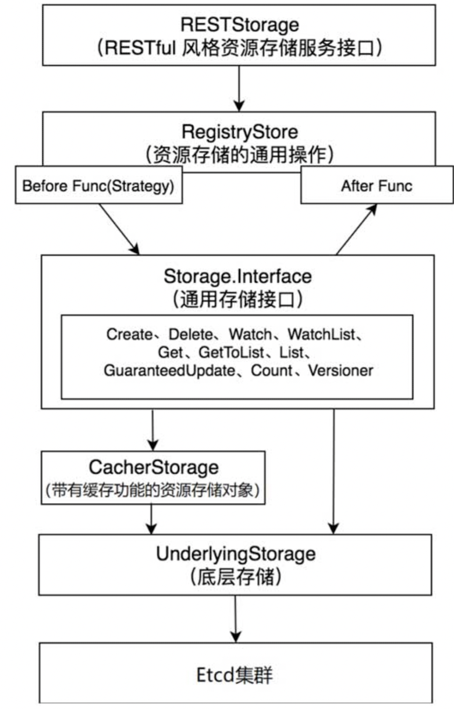

# API Server Registry

RESTful 在 K8s 中可谓是无处不在，即是是 K/V 类型的数据存储 Etcd，在 K8s 里也被封装成了 RESTful 风格。具体的封装层次为：



## 以 Deployment 资源为例

实现在 [Deployment 资源操作实现文件](../../../../../../pkg/registry/apps/deployment/storage/storage.go)中，例如 storage.go 中的 `REST` 结构体。它实现了 [rest 目录中的大多数 REST 风格的接口](./rest/rest.go)。

这个结构体内部直接引用了一个[通用的结构体 Store](./generic/registry/store.go)。这个结构体实现了 [StandardStorage](./rest/rest.go)，这个接口是一个通用的 RESTful 操作接口。

Store 这个结构体大致可以总结如下：

```go
type Store struct {
	...
	// create 操作时相关 hooks
	CreateStrategy rest.RESTCreateStrategy
	BeginCreate BeginCreateFunc
	AfterCreate AfterCreateFunc
	
	// update 操作时相关 hooks
	UpdateStrategy rest.RESTUpdateStrategy
	BeginUpdate BeginUpdateFunc
	AfterUpdate AfterUpdateFunc

	// delete 操作时相关 hooks
	DeleteStrategy rest.RESTDeleteStrategy
	AfterDelete AfterDeleteFunc
	...
	// 这是最底层操作 Etcd 的接口
	Storage DryRunnableStorage
	...
}
```

以 Store 的 Create 方法为例，流程大致如下：

```go
func (e *Store) Create(ctx context.Context, obj runtime.Object, createValidation rest.ValidateObjectFunc, options *metav1.CreateOptions) (runtime.Object, error) {  
	...
	if e.BeginCreate != nil {
		fn, err := e.BeginCreate(...)
		...
		defer func() {
			finishCreate(...)
		}()
	}

	if err := rest.BeforeCreate(...); err != nil {
		return nil, err
	}
	...
	if err := e.Storage.Create(...); err != nil {
		...
	}
	...
	if e.AfterCreate != nil {
		e.AfterCreate(...)
	}
	...
	return out, nil
}
```

可以看到，除了主流程 `e.Storage.Create()` 函数调用之外，其余语句基本都是在执行 Store 中的 hook。